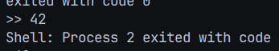
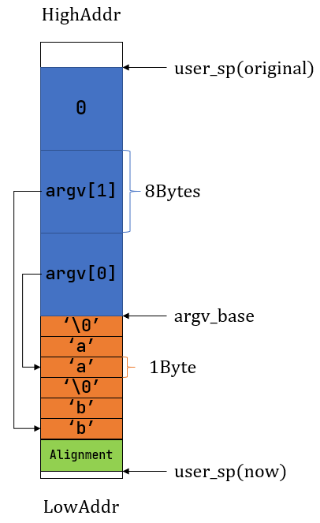
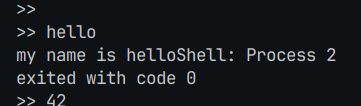
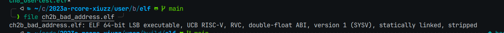
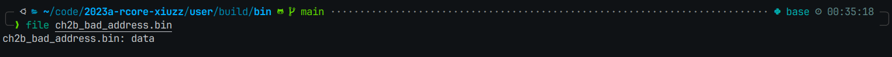

# 编程作业
## 1.1扩展easy-fs-fuse
这个比较简单跟着参考书就能给实现，不过值得注意的是参考书有一行命令有误

应该是run命令，当时看的我一脸蒙。

进入usershell后输入42即可运行42程序



## 1.2修改内核以正确执行hello程序

这个看了下ch7和该参考书前面的提示，发现了用户栈的变量顺序不同，因此不管agrc长度怎么样都无法，正确执行。


这是ch7的栈结构，很明显和指导书里面的结构是相反的，具体的参数ch7在低地址而指导书里面在高地址，且没有argc

我的实现：
```rust
        // user_sp -= (args.len() + 1) * core::mem::size_of::<usize>();
        // let argv_base = user_sp;
        // let mut argv: Vec<_> = (0..=args.len())
        //     .map(|arg: usize| {
        //         translated_refmut(
        //             memory_set.token(),
        //             (argv_base + arg * core::mem::size_of::<usize>()) as *mut usize,
        //         )
        //     })
        //     .collect();
        // *argv[args.len()] = 0;
        // for i in 0..args.len() {
        //     user_sp -= args[i].len() + 1;
        //     *argv[i] = user_sp;
        //     let mut p: usize = user_sp;
        //     for c in args[i].as_bytes() {
        //         *translated_refmut(memory_set.token(), p as *mut u8) = *c;
        //         p += 1;
        //     }
        //     *translated_refmut(memory_set.token(), p as *mut u8) = 0;
        // }
        // // make the user_sp aligned to 8B for k210 platform
        // user_sp -= user_sp % core::mem::size_of::<usize>();

        
        for i in 0..args.len() {
            user_sp -= args[i].len() + 1; 
        }
        let mut argv_end = user_sp;
        user_sp -= (args.len() + 1) * core::mem::size_of::<usize>();
        let mut argv: Vec<_> = (0..=args.len())
            .map(|arg: usize| {
                translated_refmut(memory_set.token(), 
                (user_sp + arg * core::mem::size_of::<usize>()) as *mut usize)
            })
            .collect();
        
        for i in 0..args.len() {
            let mut p = argv_end;
            argv_end += args[i].len() + 1;
            *argv[i] = p;
            for c in args[i].as_bytes() {
                *translated_refmut(memory_set.token(), p as *mut u8) = *c;
                p += 1;
            }
            *translated_refmut(memory_set.token(), p as *mut u8) = 0;
        }
```
注释掉的是原本他的代码，不过他最后一步地址对齐不知道做啥的，没有写最后运行的时候也没报错（

运行结果：



# 问答作业





两者都是可执行文件，但是如file所示，elf除了描述了可执行文件的数据，还描述了其空间布局，程序入口等其他数据信息用于帮助系统加载，也就说elf包含了bin这种可执行数据，和其他系统描述信息。


# 小结
总的来说lab1不算很难，而且之前rcore只看了前6章，lab1刚好给我补充了ch7及其后续的知识，算是一种不小的收获。上周做项目1和3去了，然后突然想起自己还报名了项目2且提交了自己的仓库地址，所以这周就算开始做了。


