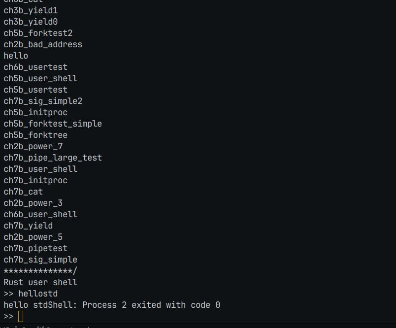

# 编程作业

## 作业1
跟着前面文档，一路做过来，在gdb调试那里研究了好久（果然不同的项目，gdb都不一样）,在群里面问了群友，才发现文档有问题，要修改下makefile，不过终归还是用成功了，然后照着文档一路实现。

## 作业2
首先会遇到29的系统调用，然后查找发现是IOCTL,用于设备控制的系统调用,然后hellostd这个c文件并没有直接调用设备，所以试着直接返回0, 然后make run一把，发现没问题，此时报错没有66系统调用，查找是writev,用于将多个缓存同时写入文件，前面有实现的write方法，试着直接调用write，然后报错了，明白了这个要自己实现，查了下文档：
```c
在Linux系统中，writev的原型定义如下：

#include <sys/uio.h>

ssize_t writev(int fd, const struct iovec *iov, int iovcnt);

iovec结构体定义如下：
struct iovec {
    void  *iov_base;    // 缓冲区的起始地址
    size_t iov_len;     // 缓冲区的长度
};
```
然后照着文档和前面的write系统调用写了份rust的writev，make run一把，成功了此时缺少系统调用94,exit_group,然后它的函数参数与exit完全一样，尝试直接调用exit，成功了:



# 问答作业

## 查询标志位定义

waitpid函数的options参数的可能取值是：

WNOHANG

WUNTRACED

WCONTINUED

WEXITED

WSTOPPED

WCONTINUED

int的32个bit中，这些可能的取值可以使用按位或运算来组合即状态压缩，将不同的操作放在不同的位上，这在算法中很常见。